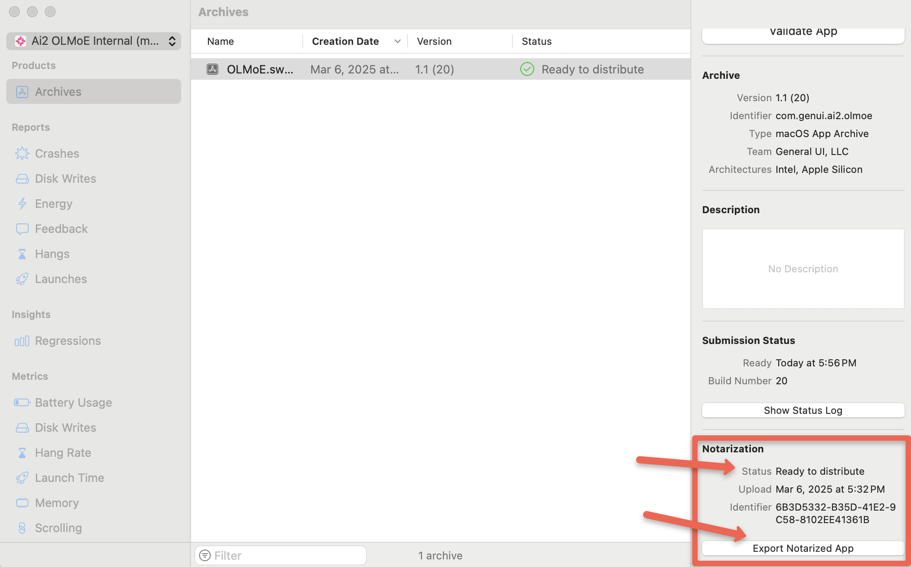

# Mac Catalyst App Creation

**IMPORTANT: Only the Account Holder (not Admins) can create Developer ID certificates.**

Developer ID certificates are particularly sensitive because they allow distributing software outside the App Store that macOS will trust.
Apple limits their creation to the Account Holder to ensure stricter control over software distributed with the team's identity.

## Step 1: Create a Certificate Signing Request (CSR)

A CSR is required to generate certificates.

1. On the *Account Holder's* Mac, open **Keychain Access** (Applications → Utilities → Keychain Access)
2. From the menu bar, select **Keychain Access → Certificate Assistant → Request a Certificate from a Certificate Authority**
3. In the Certificate Assistant window:
   - Enter your email address and common name (your name)
   - Select **Saved to disk**
   - Check **Let me specify key pair information**
   - Click **Continue**
4. Choose a location to save the file (e.g., Desktop) and name it `CertificateSigningRequest.certSigningRequest`
5. Click **Save**
6. For Key Pair Information:
   - Key Size: `2048 bits`
   - Algorithm: `RSA`
   - Click **Continue**
7. Click **Show In Finder...** to go to the file in your local file system.
8. Click **Done**

## Step 2: Create a Developer ID Application Certificate

1. On the Account Holder's machine, go to [Apple Developer Account](https://developer.apple.com/account/)
2. Login as the Account Holder.
  The Account Holder MUST create the Developer ID Application cert.
  App Managers and Admins DO NOT have permissions to create a Developer ID Application cert.
3. Click on **Certificates, IDs & Profiles** in the left sidebar
4. Under **Certificates**, click the **+** button to create a new certificate
5. Under **Software**, select **Developer ID Application** and click **Continue**
6. Read the information and click **Continue**
7. Upload the CSR file you created in "Step 1" by clicking **Choose File**
8. Select your CSR file and click **Continue**
9. Apple will generate the certificate.
   Click **Download** to save your certificate to the Account Holder's machine.
10. Ensure **Keychain Access** is open on the Account Holder's machine and the **login** default keychain is selected.
11. Double-click the downloaded `.cer` file to install it into Keychain Access

## Step 3: Verify the Certificate Installation

1. Open **Keychain Access**
2. Click on **Certificates** in the Category section
3. Look for "Developer ID Application: [Your Name/Organization] ([Team ID])"
4. Right-click on it and select **Get Info**
5. Expand the **Trust** section to verify it says "This certificate is valid"

## Step 4: Share the Developer ID Application certificate with engineers so they may create the app

The Account Holder can export the certificate with its private key for engineers:

1. Open **Keychain Access**
2. Select the "Developer ID Application" certificate
3. Right-click and select **Export**
4. Choose the `.p12` format (which includes the private key)
5. Set a password for the export
6. Send the `.p12` file and password securely to the engineer

## Step 5: Install the shared Developer ID Application certificate (on engineer machine)

1. Open **Keychain Access**
2. Select **login** under **Default Keychains**
3. Double click the shared `.p12` file
4. Enter the password that was securely shared
5. Verify that the cert is now shown in the **Certificates**
6. Verify that the cert has an attached imported private key.

## Step 6: Register Your App ID

1. Go back to [Apple Developer Account](https://developer.apple.com/account/)
2. Click on **Certificates, IDs & Profiles** in the left sidebar
3. Select **Identifiers** from the left menu
4. Click the **+** button to register a new identifier
5. Select **App IDs** and click **Continue**
6. Select **App** as the type and click **Continue**
7. Enter:
   - Description: "OLMoE Swift"
   - Bundle ID: Choose "Explicit" and enter the bundle id (ie "com.genui.ai2.olmoe")
8. Scroll down to **Capabilities** and enable **Mac Catalyst**
9. Click **Continue**, then **Register**

## Step 7: Create a Mac Catalyst Developer ID Provisioning Profile

1. **Create a Mac Catalyst Developer ID Provisioning Profile**:
   - Log in to [developer.apple.com](https://developer.apple.com/account/)
   - Go to **Certificates, Identifiers & Profiles**
   - Ensure your app ID is registered under **Identifiers** with Mac Catalyst capability
   - Go to **Profiles**
   - Click **+** to create a new profile
   - Select **Developer ID** as the distribution method
   - Click **Continue**
   - Select **Mac Catalyst** as the profile type
   - Select your app ID (ie {team_id}.{bundle_id})
      To generate a provisioning profile for an App ID with a `maccatalyst` prefix, search for the iPad app's App ID. Then select the App ID under "Enabled App IDs with an associated application identifier".
   - Click **Continue**
   - Select your Developer ID Application certificate
   - Click **Continue**
   - Name your profile and download it

2. **Install the Provisioning Profile**:
   - Double-click the downloaded `.provisionprofile` file to install it
   - Alternatively, drag it into Xcode

3. **Update Project Settings**:
   - Open your Xcode project
   - Go to your target's "Signing & Capabilities" tab
   - Select "Any Mac (MAc Catalyst)" in the device dropdown.

       

   - In the signing section:
     - Disable **Automatically manage signing**
     - Select the provisioning profile you created

## Step 8: Verify Your Setup in Xcode

1. In Xcode, go to **Xcode → Settings → Accounts**
2. Select your Apple ID
3. Click **Download Manual Profiles** at the bottom
4. Click **Manage Certificates**
5. You should see your Developer ID Application certificate listed

## Step 9: Build and Archive the App

1. Select **Product → Archive** in Xcode
2. When the archive is complete, the Organizer window will automatically open
3. Select your archive
4. Click **Distribute App**
5. Select **Custom**
6. Select **Direct Distribution**
7. Click **Next**
8. Select **Upload**
9. Select **Manually manage signing**
10. Click **Next**
11. Select the appropriate certificate and Developer ID profiles:
    - For Distribution certificate, select your Developer ID Application certificate created in Step 2
    - For OLMoE.swift.app, select the Provisioning Profile created in Step 7
    - Click **Next**
12. Review the submission
13. Click **Upload**
14. You will see a notification stating:

    ``` txt
    Uploaded "OLMoE.swift" to Apple notary service
    You will receive a notification when your app is ready for distribution.
    ```

15. Click **Close**
16. Wait a few minutes for the following notification from Xcode:

    "Application OLMoE.swift.app is ready for distribution"

    The "Status" will be `Ready to distribute`

    

17. Click the **Export Notarized App** button in the notification and select a destination folder
18. If you accidentally dismiss the notification, you can still export your app by:
    - Opening the Organizer again by selecting **Window → Organizer**
    - Selecting your archive (the one that was just notarized by Apple)
    - Clicking **Distribute App**
    - Selecting **Direct Distribution**
    - Clicking **Export**
    - Selecting a destination folder

### Alternative: Manual Export Method

If you continue to face issues with Xcode distribution, you can try a manual export:

1. Select **Product → Archive** in Xcode
2. When the archive is complete, the Organizer window will automatically open
3. Select your archive
4. Click **Distribute App**
5. Select **Custom**
6. Select **Direct Distribution**
7. Click **Next**
8. Select **Export** (Sign and export without notarizing)
9. Select the appropriate certificate and Developer ID profiles:
   - For Distribution certificate, select your Developer ID Application certificate created in Step 2
   - For OLMoE.swift.app, select the Provisioning Profile created in Step 7
   - Click **Next**
10. Click **Export** and select a destination folder
11. This will produce an OLMoE.swift.app file in your destination folder. Note that this app still needs to be notarized before distribution

### Manual Notarization

If you exported your app without uploading to Apple, you'll need to use the command line to notarize your app:

1. Create a zip file of your `.app`

   ``` sh
   ditto -c -k --keepParent YourApp.app YourApp.zip
   ```

   Note: This zip is created only for uploading to Apple and should not be used for distribution.

2. Create an App-Specific Password:
   - Go to <https://account.apple.com/> and sign in with your Apple ID
   - In the left sidebar menu, click **Sign-In and Security**
   - Click **App-Specific Passwords**
   - If prompted, sign in again
   - Provide a name for the password
   - Click **Create**
   - Store your password securely

3. Submit for notarization (requires App Store Connect credentials and the App-Specific password you just created):

   ``` sh
   xcrun notarytool submit YourApp.zip --apple-id "your-apple-id" --password "app-specific-password" --team-id "your-team-id"
   ```

   The output of this command should look similar to this:

   ``` sh
   Conducting pre-submission checks for OLMoE.swift.zip and initiating connection to the Apple notary service...
   Submission ID received
   id: [UUID]
   Upload progress: 100.00% (3.50 MB of 3.50 MB)
   Successfully uploaded file
   id: [UUID]
   path: /Users/stanley/Downloads/OLMoE.swift 2025-03-06 10-18-35/OLMoE.swift.zip
   ```

4. Check the notarization status (using the UUID from the previous command):

   ``` sh
   xcrun notarytool info [UUID] --apple-id "your-apple-id" --password "app-specific-password" --team-id "your-team-id"
   ```

   For detailed logs:

   ``` sh
   xcrun notarytool log [UUID] --apple-id "your-apple-id" --password "app-specific-password" --team-id "your-team-id"
   ```

5. After successful notarization, staple the ticket to your app:

   ``` sh
   xcrun stapler staple YourApp.app
   ```
