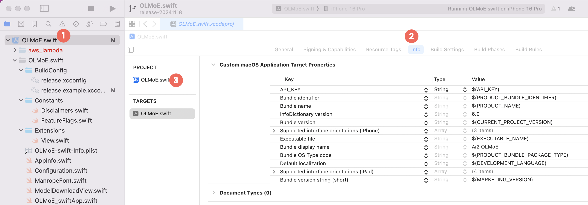

# OLMoE Swift

## Requirements

- Xcode 15.4+
- iOS 17+

## Configuration

1) Log in to [Apple Developer](https://developer.apple.com).
    To find the Team ID, see: [Locate your team ID](https://developer.apple.com/help/account/manage-your-team/locate-your-team-id/).

1) Rename `BuildConfig/release.example.xcconfig` to `release.xcconfig`.

1) Populate the `release.xcconfig` file with your API key and endpoint.

    The `API_URL` should be the endpoint to access the lambda function.
    In our example, we used an AWS API Gateway endpoint that forwards requests to the lambda function.

    The `API_KEY` is the key to access the API Gateway endpoint.

    The `DEVELOPMENT_TEAM_ID` is your team ID you located in step 1.

    The `PRODUCT_BUNDLE_IDENTIFIER` is the bundle identifier for the app.
    This can be assigned your unique identifier or the default one.

    ```ini
    API_KEY=your_api_key_here
    API_URL=api_url
    DEVELOPMENT_TEAM_ID=your_team_id
    PRODUCT_BUNDLE_IDENTIFIER=com.example.apple-samplecode.OLMoE.swift.${DEVELOPMENT_TEAM_ID}

    ```

1) Open the project in Xcode.

1) Select the project in the Project Navigator.

1) Go to Info -> Select Project OLMoE Swift

    

1) In configurations ensure "Debug and Release" is set to use `release.xcconfig`

    
