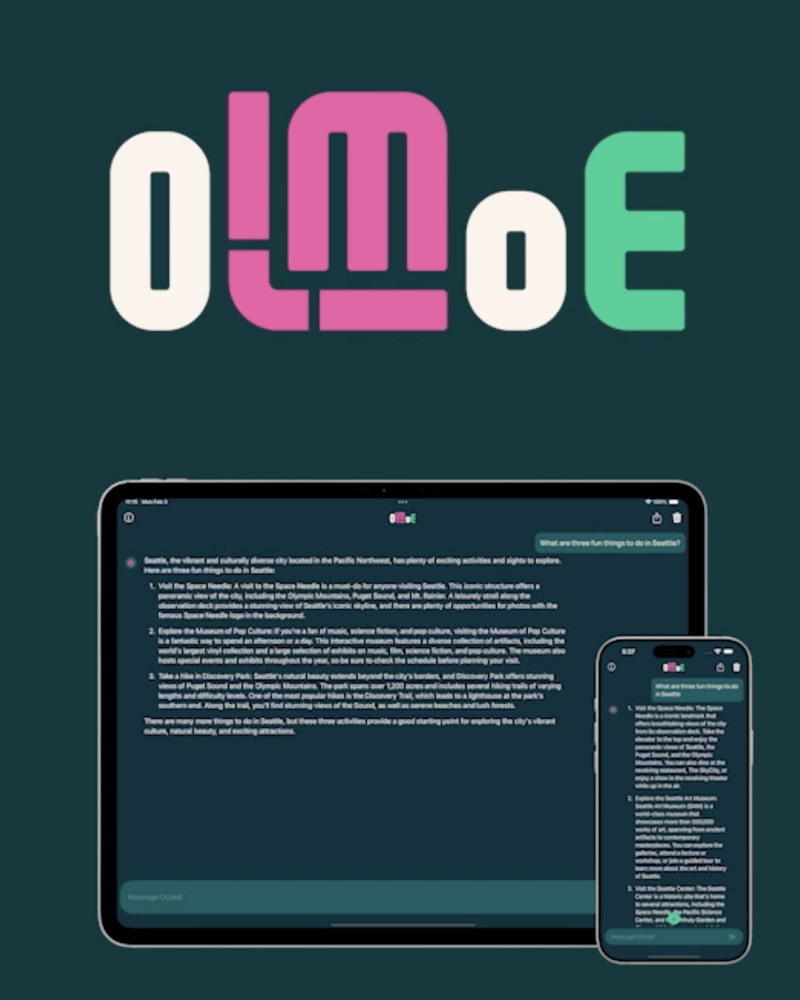

<div align="center">
  
  <br>
  <h1>Ai2 OLMoE</h1>
</div>
<p align="center">
  <a href="https://github.com/allenai/OLMo/blob/main/LICENSE">
    
  </a>
  <a href="https://playground.allenai.org">
    
  </a>
  <a href="https://discord.gg/sZq3jTNVNG">
    
  </a>
</p>

## Getting started with OLMoE app

1. **Open the app** – Launch OLMoE app on your device.
2. **Download the model** – The app may prompt you to download the required model files. Just follow the instructions and wait for the download to complete.
3. **Ask questions** – Once the model is ready, type in your question, and the app will generate a response.

We **don’t** store any of your queries or data—everything runs on your device. You can even use the app in **Flight Mode** with no internet connection.

Enjoy a fully open, private, and offline capable AI experience with OLMoE.

## OLMoE.swift

Clone the repository in your respective directory by

``` sh
git clone https://github.com/allenai/OLMoE.swift.git
```

### Building the iOS app to run on a simulator

1) Open the project in Xcode.

1) Ensure the target device is set to an appropriate device (ie iPhone 15 Pro or higher)

    

1) Run the project

For more information see [OLMoE.swift/README.md](OLMoE.swift/README.md) or to

- [run the iOS App with custom settings](./OLMoE.swift/README.md#building-the-ios-app-with-custom-settings)
- [run on MacOS](./OLMoE.swift/README.md#running-on-macos)
- [run on a physical device](OLMoE.swift/README.md#running-on-a-physical-device)

## Running OLMoE with Hugging Face

Install `transformers` (version 4.45.0 or greater) & `torch` and run:

```python
from transformers import OlmoeForCausalLM, AutoTokenizer
import torch

DEVICE = "cuda" if torch.cuda.is_available() else "cpu"

# Load different ckpts via passing e.g. `revision=step10000-tokens41B`
model = OlmoeForCausalLM.from_pretrained("allenai/OLMoE-1B-7B-0125").to(DEVICE)
tokenizer = AutoTokenizer.from_pretrained("allenai/OLMoE-1B-7B-0125")
inputs = tokenizer("Bitcoin is", return_tensors="pt")
inputs = {k: v.to(DEVICE) for k, v in inputs.items()}
out = model.generate(**inputs, max_length=64)
print(tokenizer.decode(out[0]))
# > # Bitcoin is a digital currency that is created and held electronically. No one controls it. Bitcoins aren’t printed, like dollars or euros – they’re produced by people and businesses running computers all around the world, using software that solves mathematical
```

## aws-lambda

This is a lambda function used for the "sharing" feature of the OLMoE app. See [aws-lambda/README.md](aws-lambda/README.md) for more information.

## License

This project is open source. See [LICENSE](LICENSE) for more information.

## Open Source Dependencies

This project relies on the following open-source libraries, each licensed under the **MIT License**:

### [LlamaCPP](https://github.com/ggerganov/llama.cpp)

- **Author(s):** The ggml authors (2023-2024)
- **License:** MIT
- **Repository:** [LlamaCPP](https://github.com/ggerganov/llama.cpp)

### [ggml](https://github.com/ggerganov/ggml)

- **Author(s):** The ggml authors (2023-2024)
- **License:** MIT
- **Repository:** [ggml](https://github.com/ggerganov/ggml)

### [MarkdownUI](https://github.com/gonzalezreal/swift-markdown-ui)

- **Author(s):** Guillermo Gonzalez (2020)
- **License:** MIT
- **Repository:** [MarkdownUI](https://github.com/gonzalezreal/swift-markdown-ui)

For more details on each license, visit the respective repositories linked above.
